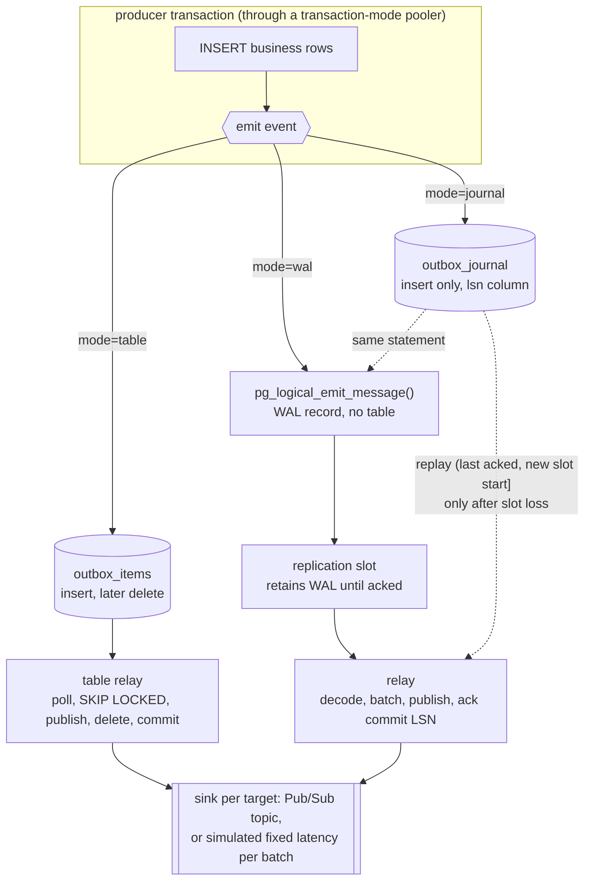

# Design: a transactional outbox without the outbox table

This document explains what the prototype is meant to do, how it differs from a
conventional outbox table, and the trade-offs. It is written for an engineering
audience deciding whether to take the approach further.

## The problem with a table outbox

A conventional outbox is a table. Producers insert a row in the same transaction as
their business write. A relay selects a batch, publishes it to the broker, deletes the
rows and commits. This gives atomic enqueue and at-least-once delivery, and it is the
right design.

The cost is churn. Every event is one INSERT and one DELETE, so every event leaves a dead
tuple and dead index entries behind. Postgres has to vacuum them away, and under bursty
load vacuum falls behind: the relay's selects walk over thousands of dead entries, the
index bloats, and the table needs aggressive autovacuum settings and periodic reindexing
just to hold steady. The write pattern is already minimal, so no change to the relay
query fixes this. The only way to remove the churn is to stop writing rows, or at least
to stop deleting them.

## The three transports



**`table`** is the baseline: the conventional outbox.

**`wal`** removes the table. `pg_logical_emit_message(true, target, payload)` writes the
payload into the write-ahead log as part of the open transaction. It touches no table.
A rolled-back transaction never produces the record. A logical replication slot on the
primary keeps every log record after the slot's confirmed position; the relay reads the
stream over a replication connection, keeps messages whose prefix equals its target,
batches them, publishes, and only then advances the slot to the end of the last fully
published source transaction.

**`journal`** is `wal` plus a safety net, in the spirit of LISTEN/NOTIFY backed by
polling: the log stream is the fast path, an append-only table is the recovery path.
The producer writes both in one statement, storing the message's log position in the
row:

```sql
INSERT INTO outbox_journal (target, payload, lsn)
VALUES ($1, $2, pg_logical_emit_message(true, $1, $2));
```

In steady state the journal is never read. Nobody updates or deletes it. It is
partitioned by day and old partitions are dropped after a retention period, so it costs
one insert per event and produces no dead tuples. When a relay reconnects and finds its
slot gone, it creates a new one, which returns the position the new stream starts
from, replays the journal rows for its target between its last acknowledged position
and that start, then streams. The relay keeps its last acknowledged position in a
state file outside Postgres for exactly this purpose.

## Targets

Every event names a target. In `wal` and `journal` the target is the message prefix; in
`table` it is a column. One relay serves one target: it has its own slot, keeps only
that prefix, and publishes to that target's topic. Lag, restarts and throughput are
independent per destination, and a slow consumer for one target never holds back
another. The cost is that each relay decodes the whole stream and discards other
targets' messages, so server-side decoding work scales with the number of targets. For
a handful of targets that is negligible; for dozens, one relay fanning out from one
slot is the alternative, at the cost of shared lag.

## Benefits over the table

- **Zero or append-only churn.** `wal` writes no rows. `journal` writes one row per
  event and never touches it again; dropping a partition costs nothing and leaves no
  dead tuples. Either way there is no vacuum pressure, no index bloat and no reindexing.
- **Same atomicity as a table.** The event is committed or discarded with the business
  write. There is no window where the two disagree.
- **Commit order for free.** Logical decoding delivers transactions in commit order, so
  the id-gap problem that forces table relays to delete rather than track a cursor does
  not exist.
- **Same restart semantics as a table.** The slot position replaces the relay's
  transaction. A crash before acknowledgement replays, never drops. Delivery is
  at-least-once in every mode and consumers dedupe on the message id in every mode.
- **Fewer relay queries.** No polling and no batch selects. The relay receives a push
  stream and issues one status update per acknowledged batch.
- **Pooler friendly on the producer side.** Nothing session-scoped is used, so
  producers can sit behind a transaction-mode pooler. Only the relay needs a direct
  connection.
- **Self-healing with `journal`.** A failover that loses the slot is recovered
  automatically, as long as journal retention exceeds the outage.

## Downsides and risks

- **`wal` has nothing to look at.** Pending events are opaque log bytes until the relay
  decodes them. Replay is bounded by retained log and the slot position; a true
  backfill means re-deriving events from business state. `journal` restores SQL
  visibility and replay for the retention window.
- **The buffer is bounded by disk, not by table size.** A table grows while the relay is
  down. Retained log grows too, on the primary's disk, until `max_slot_wal_keep_size`
  or the disk is exhausted. When the keep size is hit Postgres invalidates the slot and
  everything unacknowledged is lost in `wal`, or recovered from the journal in
  `journal`. Either way it needs a paging alert on slot lag and disk headroom.
- **Slot loss on failover.** Logical slots live on the primary. Whether they survive a
  failover depends on how the standby is built:
  - A standby that shares the primary's disk, as some managed services implement
    regional high availability, carries the slot and its retained log with it. Verify
    by forcing a failover with a deliberately lagging slot.
  - A streaming replica, which is what most self-managed clusters and cross-region
    disaster recovery replicas use, does not get the slot. Postgres 17 adds failover
    slots that are synchronised to standbys, if the cluster manager or hosting
    platform supports the required settings; before 17 the pg_failover_slots extension
    does the same job where extensions can be installed.
  - Where neither applies, `journal` turns the loss into a replay, and `wal` should
    only carry events that can be rebuilt from business state.
- **Per-instance prerequisites.** `wal_level = logical`, a free replication slot, a role
  with the replication attribute, and on managed platforms a flag that restarts the
  instance. Logical write-ahead logging also increases log volume somewhat on busy
  tables.
- **One consumer per slot.** A second relay attaching to an active slot is refused, so
  deploys must stop the old instance before starting the new one, and scaling out means
  more targets rather than competing workers on one target.
- **Bytes are still written.** The payload goes into the write-ahead log, which is
  fsynced, physically replicated and archived. The heap, index and vacuum costs are
  gone; the write itself is not. `journal` adds the row's own log records back.
- **Duplicates are per transaction.** Acknowledgement moves only at commit boundaries,
  so a crash replays whole source transactions, including the already-published part of
  one that straddled a batch. Non-transactional messages have no commit record and are
  replayed on every restart until a later commit moves the position past them.
- **Journal replay window edge.** The stored `lsn` is where the message was written, not
  where its transaction committed. A long transaction can hold a low position and commit
  after a higher one was acknowledged. Replaying from a margin below the last
  acknowledged position, and dedupe on the consumer, covers it.
- **Thin tooling outside Go and Java.** Debezium handles these messages natively and
  Debezium Server has a Pub/Sub sink. Go has pglogrepl. Most other CDC tools and every
  surveyed Ruby outbox library handle row changes only, so a custom relay is Go or
  Java.
- **The relay must not create a slot silently in production.** The prototype does, for
  convenience. A missing slot with existing state should page someone in `wal` mode
  and trigger the journal replay in `journal` mode, which is what the prototype logs.

## Operational checklist before production

- Slot lag and retained log size exported as metrics, with alerts well below the keep
  size.
- `max_slot_wal_keep_size` set from measured disk headroom, not left unlimited.
- A forced failover test, with a lagging slot, per platform and edition, with the
  result recorded.
- Relay deployed as a singleton per target, stop-before-start, with a final flush on
  shutdown to avoid duplicates on routine restarts, and its state file on durable
  storage.
- Journal partition creation and retention automated, with retention longer than the
  longest outage you intend to survive.
- A written decision per event type: `wal`, `journal` or `table`, based on whether the
  event can be re-derived after a slot loss and on the platform's failover behaviour.
- Consumers idempotent on the message id.

## Open questions this prototype does not answer

- Log volume per event under representative payloads on the real write-ahead log
  settings, beyond what the benchmark measures with the simulated sink.
- Decoding throughput of a single slot at sustained peak rate with many targets.
- Whether the hosting platform preserves slots on standard failover, and on which
  editions.
